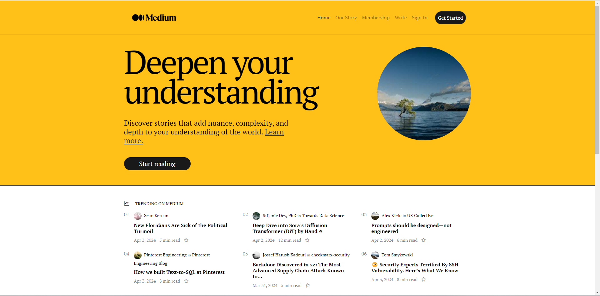
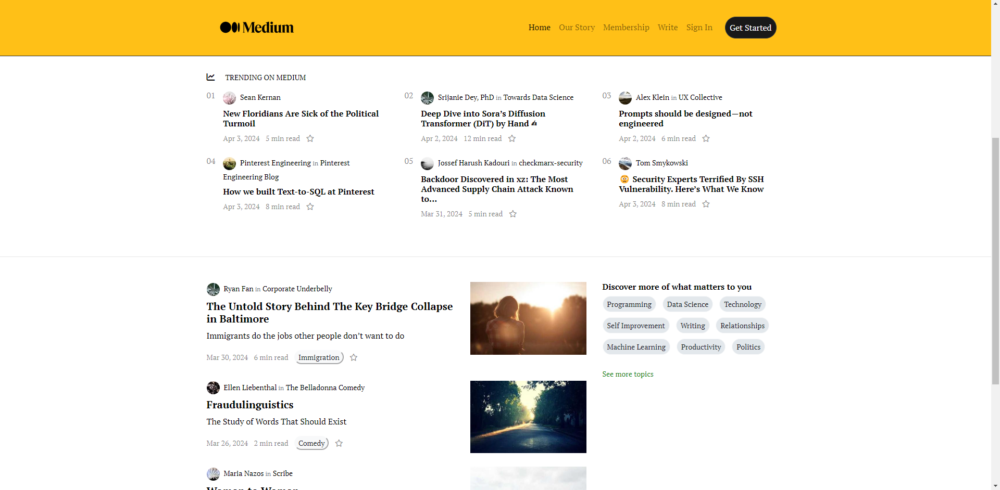
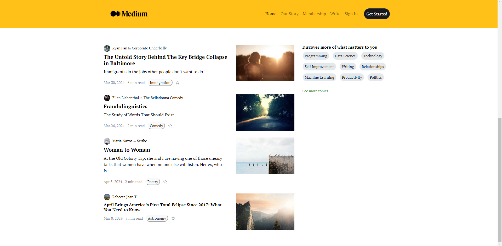

# Medium Project

This project creates a simple version of a Medium-like website. It's built using HTML, CSS, and JavaScript.

## Technologies Used

- HTML
- CSS
- JavaScript
- Bootstrap
- FontAwesome
- Google Fonts

## Installation

1. Clone the project to your local machine.
2. Open the `index.html` file in a web browser.