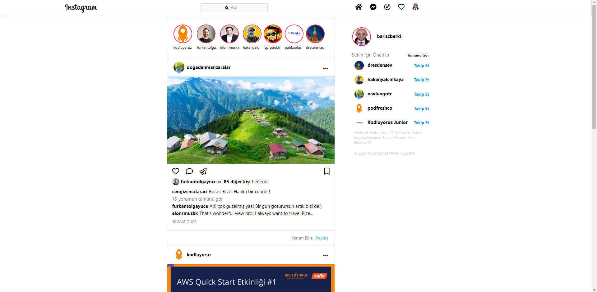
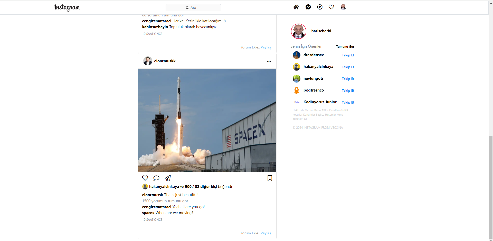

# Instagram Bootstrap Clone

This project is a simple clone of Instagram's interface, built using HTML and Bootstrap. It's a great way to learn and understand how to use Bootstrap for web development.

## Features

- Responsive design that looks great on both desktop and mobile devices.
- Use of Bootstrap components like navbar, cards, and forms.
- Clean and easy-to-understand code.

## Screenshots

Here are some screenshots of the project:

## Installation

To get started with this project, follow these steps:

1. Clone the repository
2. Open the `index.html` file in your browser.

## Contributing

Contributions are welcome! Please feel free to submit a Pull Request.
