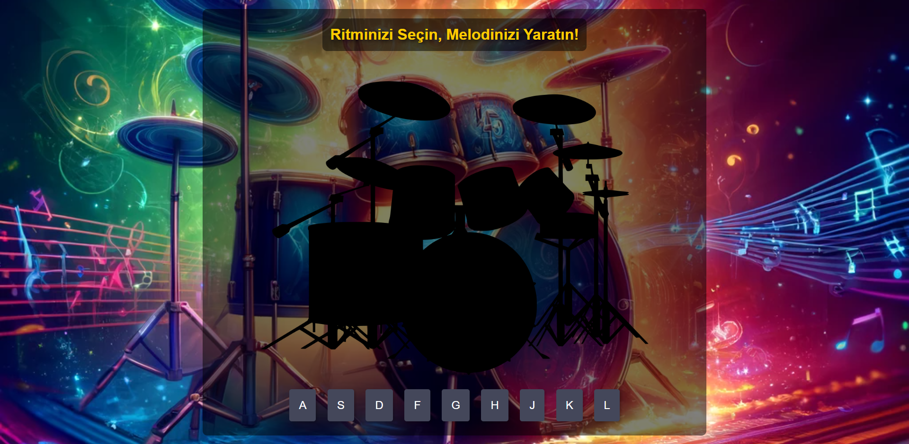

# Drum Kit Website
This project is a simple Drum Kit simulation on the web. Users can produce drum sounds using keyboard keys or mouse clicks.

## Technologies Used
- HTML5: Structures the web page.
- CSS3: Styles and designs the page.
- JavaScript: Manages interactions and sound playback functions.

## Features
- Web-based drum simulation
- Keyboard and mouse support
- Dynamic sound output
- Aesthetic and user-friendly interface

## Installation
To run this project locally, follow these steps:
1. Clone or download this repository.
2. Open `index.html` file through a web server in the downloaded folder.

## How to Use?
- Keyboard keys from 'A' to 'L' correspond to different drum sounds.
- You can also produce sounds by clicking the buttons with the mouse.

## License
This project is licensed under the MIT License. For more information, see the `LICENSE` file.

---

# Drum Kit Web Sitesi
Bu proje, basit bir Drum Kit simülasyonunu web üzerinde gerçekleştirmektedir. Kullanıcılar klavye tuşlarıyla veya fareyle davul sesleri çıkarabilirler.

## Kullanılan Teknolojiler
- HTML5: Web sayfasının temel yapısını oluşturur.
- CSS3: Sayfanın stilini ve tasarımını sağlar.
- JavaScript: Sayfadaki etkileşimleri ve ses çalma işlevlerini yönetir.

## Özellikler
- Web tabanlı davul simülasyonu
- Klavye ve fare desteği
- Dinamik ses çıkışı
- Estetik ve kullanıcı dostu arayüz

## Kurulum
Projeyi yerel olarak çalıştırmak için aşağıdaki adımları takip edin:
1. Bu depoyu klonlayın veya indirin.
2. İndirilen klasörde, bir web sunucusu üzerinden `index.html` dosyasını açın.

## Nasıl Kullanılır?
- Klavye tuşları 'A' dan 'L' ye kadar olan harflerle eşlenmiş davul seslerini çıkarır.
- Fare ile butonlara tıklayarak da ses çıkarabilirsiniz.

