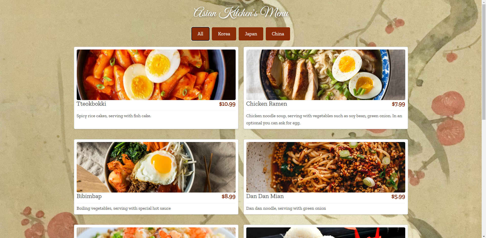
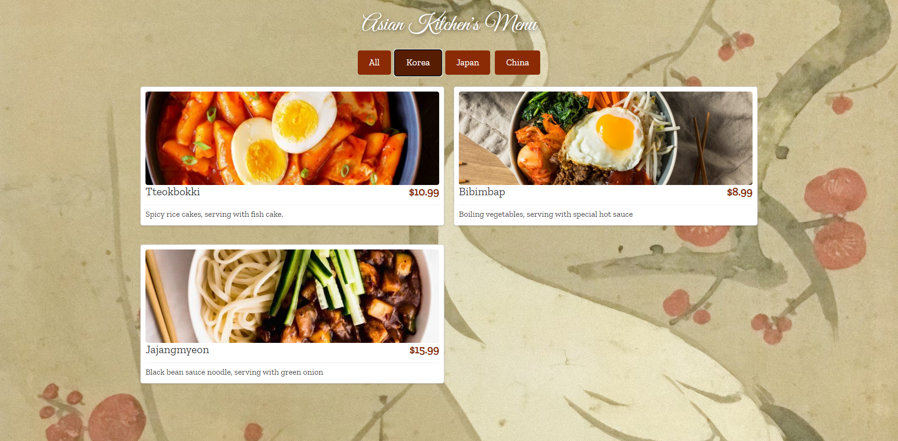
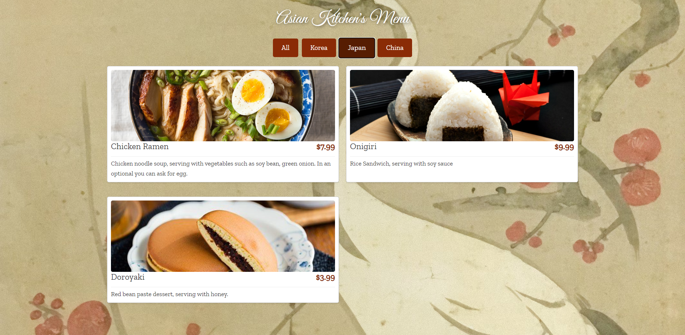
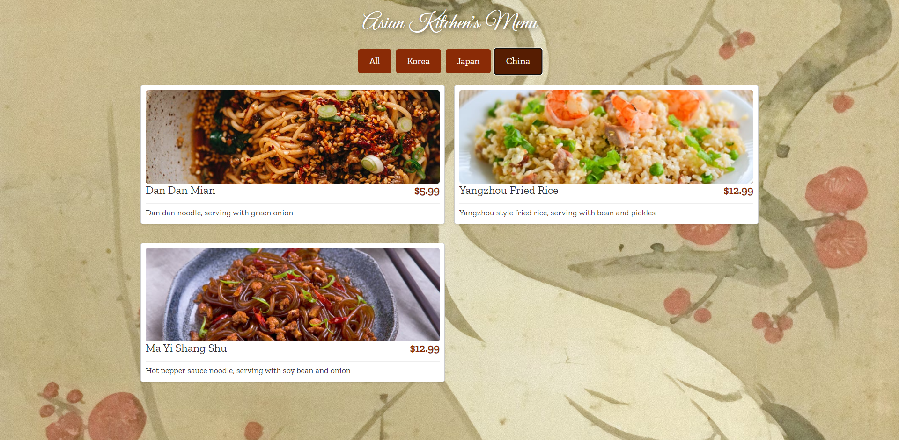

# Asian Kitchen's Menu

Welcome to the Asian Kitchen's Menu project! This web application showcases a beautifully designed menu featuring various dishes from across Asia, allowing users to filter dishes by country.

## Features

- **Dynamic Menu Filtering**: Users can filter the menu by food categories, including Korea, Japan, and China.
- **Responsive Design**: The site is fully responsive, adapting to various screen sizes and devices.
- **Interactive UI**: Enhanced user experience with interactive elements such as hover effects on buttons and dynamic backgrounds.

## Live Site

Experience the live site: [Asian Kitchen's Menu](https://veccina-asian-menu.netlify.app)

## Screenshots

Here are some screenshots of the website in action:

### Menu 1


### Menu 2


### Menu 3


### Menu 4


## Technologies Used

- **HTML**: For structuring the web content.
- **CSS**: For styling the web pages including responsive designs.
- **JavaScript**: For dynamic interactions and filtering logic.

## Setup

To clone and run this application locally, follow these steps:

```bash
git clone https://example.com/your-repo.git
cd your-repo
# open index.html in your web browser
