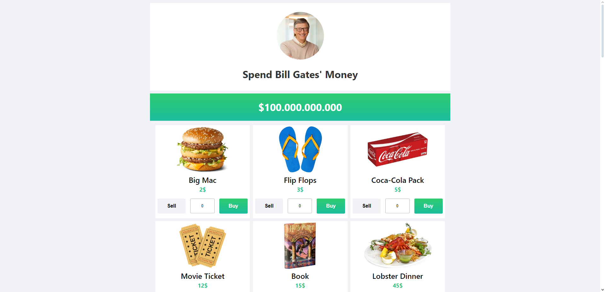
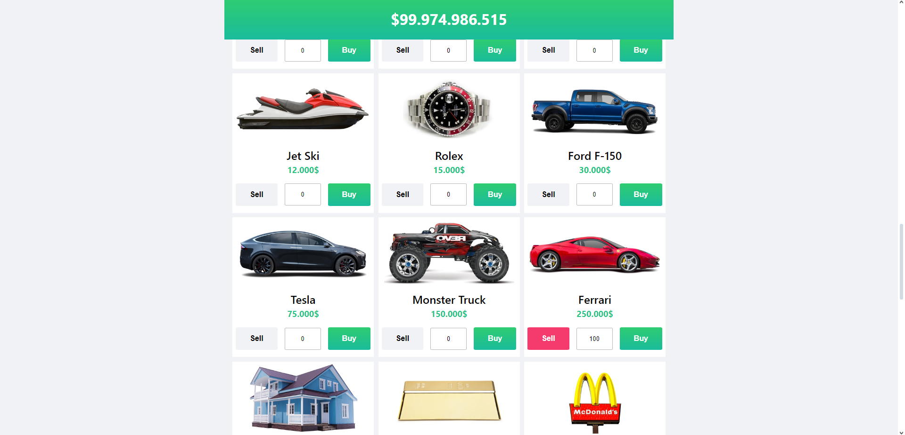
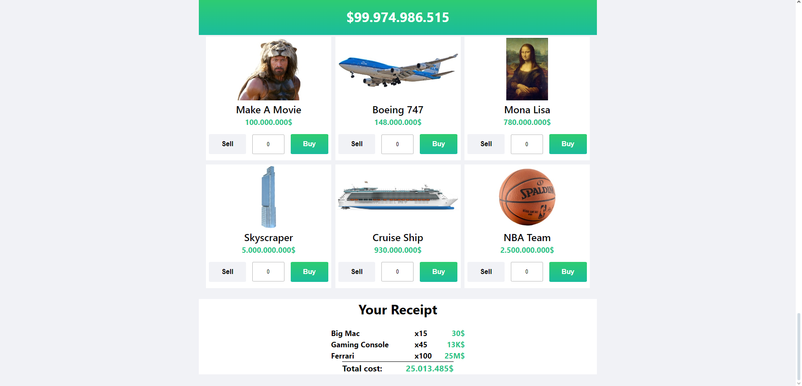

# Harcama Uygulaması

Bu proje, çeşitli ürünlerin maliyetlerini görüntüleyip seçebileceğiniz ve toplam harcamanızı görebileceğiniz bir harcama uygulamasıdır. Uygulama, React ile geliştirilmiştir ve Netlify üzerinde barındırılmaktadır.

## Canlı Demo
Uygulamayı canlı olarak incelemek için [buraya tıklayabilirsiniz](https://veccina-spend.netlify.app).

## Ekran Görüntüleri
Aşağıda uygulamanın bazı ekran görüntüleri bulunmaktadır:





## Kullanılan Teknolojiler

Bu projede aşağıdaki teknolojiler kullanılmıştır:

-  **React**: Kullanıcı arayüzlerini oluşturmak için.
-  **CSS**: Stiller için.
-  **JavaScript**: Dinamik işlevsellik için.
-  **Netlify**: Uygulamanın barındırılması için.

## Proje Yapısı

### Bileşenler ve Dosyalar

- **item.js**: Ürünlerin görüntüleri ve maliyetlerini içeren veri dosyası.
- **Receipt.jsx**: Seçilen ürünlerin ve toplam maliyetin görüntülendiği fatura bileşeni.
- **receipt.css**: Fatura bileşeni için stil dosyası.
- **ContextApi.jsx**: Global durumu yönetmek için kullanılan Context API bileşeni.
- **Header.jsx**: Uygulamanın başlık bileşeni.
- **header.css**: Başlık bileşeni için stil dosyası.
- **ItemCards.jsx**: Ürün kartlarının görüntülendiği bileşen.
- **item-cards.css**: Ürün kartları için stil dosyası.
- **MoneyBar.jsx**: Bütçe veya harcama çubuğunun görüntülendiği bileşen.
- **money-bar.css**: Bütçe çubuğu için stil dosyası.
- **index.css**: Genel stil dosyası.
- **main.jsx**: Uygulamanın ana dosyası.

## Kurulum ve Çalıştırma

Projeyi yerel ortamınızda çalıştırmak için aşağıdaki adımları takip edebilirsiniz:

1. Bu repoyu klonlayın:
    ```sh
    git clone
    ```

2. Proje dizinine gidin:
    ```sh
    cd 
    ```

3. Gerekli bağımlılıkları yükleyin:
    ```sh
    npm install
    ```

4. Uygulamayı başlatın:
    ```sh
    npm start
    ```

## Kullanım

Uygulama açıldıktan sonra, ürünleri seçip sepetinize ekleyebilir ve toplam harcamanızı görebilirsiniz.

## Katkıda Bulunma

Katkıda bulunmak isterseniz, lütfen bir pull request gönderin veya bir issue açın.

## Lisans

Bu proje MIT Lisansı ile lisanslanmıştır.
