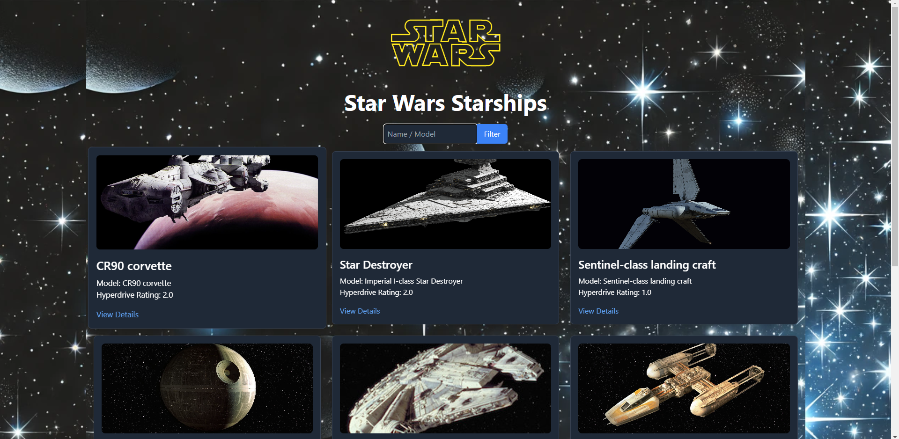
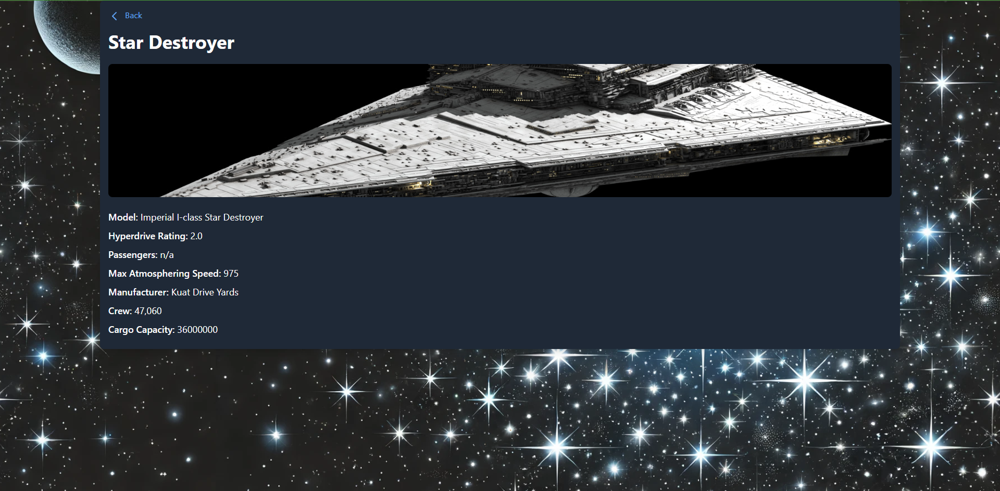
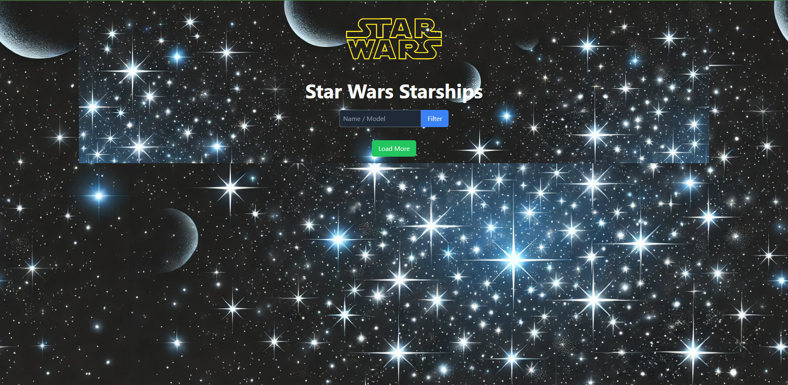

# Star Wars Starships

## Projektbeschreibung

Dieses Projekt ist eine Star Wars Starship-Anwendung, die mit React, Tailwind CSS und Framer Motion erstellt wurde. Die Anwendung verwendet die Star Wars API (SWAPI), um Informationen über Star Wars Raumschiffe abzurufen. Benutzer können nach Raumschiffen suchen und eine detaillierte Ansicht jedes Raumschiffs anzeigen.

### Verwendete Technologien

- **React** 
- **Tailwind CSS** 
- **Framer Motion** 
- **Axios** 

### Bildschirmfotos

## Live-Demo

[Live-Demo ansehen](https://veccina-star-wars.netlify.app)

---

## Project Description

This project is a Star Wars Starship application built using React, Tailwind CSS, and Framer Motion. The application uses the Star Wars API (SWAPI) to fetch information about Star Wars starships. Users can search for starships and view detailed information about each starship.

### Technologies Used

- **React** 
- **Tailwind CSS** 
- **Framer Motion** 
- **Axios** 

### Screenshots

## Live Demo

[View Live Demo](https://veccina-star-wars.netlify.app)

---

## Proje Açıklaması

Bu proje, React, Tailwind CSS ve Framer Motion kullanılarak oluşturulmuş bir Star Wars Yıldız Gemisi uygulamasıdır. Uygulama, Star Wars gemileri hakkında bilgi almak için Star Wars API'sini (SWAPI) kullanır. Kullanıcılar yıldız gemilerini arayabilir ve her bir gemi hakkında ayrıntılı bilgi görüntüleyebilir.

### Kullanılan Teknolojiler

- **React** 
- **Tailwind CSS** 
- **Framer Motion** 
- **Axios** 

### Ekran Görüntüleri

## Canlı Demo

[Canlı Demoyu Görüntüle](https://veccina-star-wars.netlify.app)
