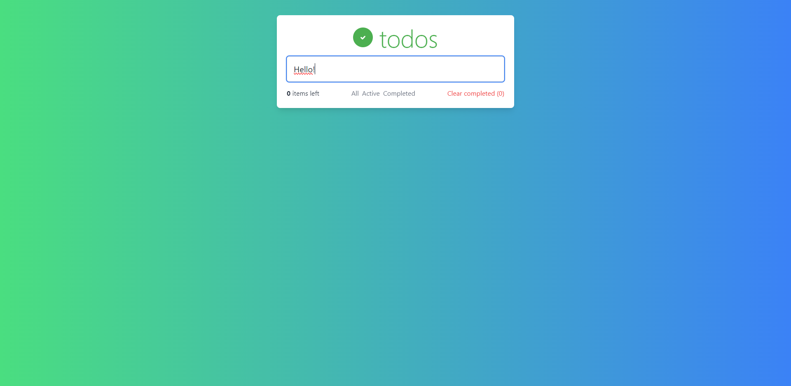

# Todo App



## Canlı Önizleme

[Canlı Önizleme](https://lets-to-do.netlify.app)

## Proje Hakkında

Bu proje, görevlerinizi yönetmenize yardımcı olacak basit ve kullanıcı dostu bir Todo uygulamasıdır. Kullanıcılar görev ekleyebilir, tamamlanan görevleri işaretleyebilir ve tamamlanan görevleri temizleyebilir. Ayrıca görevler "Hepsi", "Aktif" ve "Tamamlananlar" olarak filtrelenebilir.

## Kullanılan Teknolojiler

- **React** 
- **Tailwind CSS** 
- **Vite** 

## Özellikler

- Görev ekleme
- Görev tamamlama
- Görevleri filtreleme (Hepsi, Aktif, Tamamlananlar)
- Tamamlanan görevleri temizleme
- Yerel depolama ile görevlerin saklanması

## Ekran Görüntüleri

### Ana Ekran


### Görev Ekleme


### Görevleri Filtreleme


## Kurulum ve Çalıştırma

Projeyi yerel makinenizde çalıştırmak için aşağıdaki adımları izleyin:

1. Bu repoyu klonlayın:
    ```sh
    git clone
    ```
2. Proje dizinine gidin:
    ```sh
    cd todo-app
    ```
3. Gerekli paketleri yükleyin:
    ```sh
    npm install
    ```
4. Uygulamayı başlatın:
    ```sh
    npm run dev
    ```

Tarayıcınızda `http://localhost:3000` adresine giderek uygulamayı görebilirsiniz.

## Katkıda Bulunma

Katkılarınızı memnuniyetle karşılıyoruz! Eğer bu proje üzerinde çalışmak isterseniz, lütfen bir fork yapın ve pull request gönderin.

1. Fork yapın
2. Bir branch oluşturun (`git checkout -b feature/fooBar`)
3. Değişikliklerinizi commit yapın (`git commit -am 'Add some fooBar'`)
4. Branch'e push yapın (`git push origin feature/fooBar`)
5. Bir pull request oluşturun

## Lisans

Bu proje MIT Lisansı altında lisanslanmıştır. Daha fazla bilgi için `LICENSE` dosyasına bakın.

